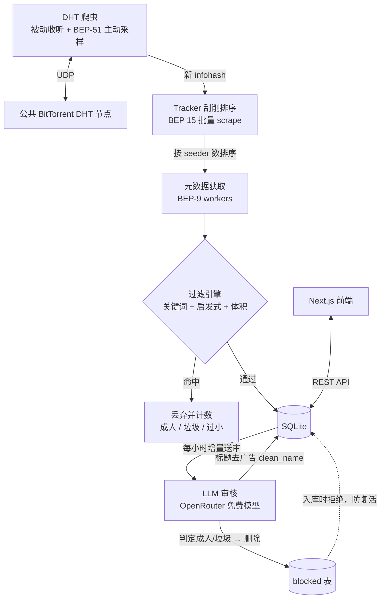

# DHTSearch

[](LICENSE)

> Co-authored by [Kimi K3](https://www.kimi.com/).

一个自建索引的磁力链接搜索网站：Go 后端通过 DHT 网络爬虫实时采集磁力链接元数据，自动过滤成人内容与垃圾信息，Next.js 前端提供干净的搜索界面。

## 架构



- `server/` — Go 后端：DHT 爬虫（anacrolix/dht/v2）、BEP-9 元数据获取（anacrolix/torrent）、过滤引擎（中英文成人词表 + 垃圾启发式）、SQLite 存储（modernc.org/sqlite，无 cgo）、REST API（标准库 net/http）
- `web/` — Next.js 前端（App Router + Tailwind，服务端渲染搜索结果）

### 发现速度

infohash 来自两条路径，**主动的那条决定吞吐**：

- **被动**：别的节点发来的 `get_peers` / `announce_peer`。只在公网可达时才有量，NAT/VPN 后面基本为零。
- **主动（BEP-51）**：`DHT_SAMPLERS` 个 worker 并发对路由表里的节点发 `sample_infohashes`，每个节点一次能返回几十个 infohash。查询带随机 `target`，回包里的节点又会入队，于是采样本身就是一次 ID 空间游走；每个节点按它自己声明的 `interval`（钳在 1 分钟～2 小时）重采。
- 路由表由 `TableMaintainer` 维护 + 定时随机 `find_node` 拓宽——**路由表空了发现就会停**，`/api/stats` 的 `crawler.nodes` 就是看这个的。

`crawler.harvested / crawler.sampled` 是每次采样的平均产出；`crawler.nodes` 归零就说明发现要停。

**发现从来不是瓶颈，元数据获取才是。** 8 个 sampler 每分钟就能挖出约 3000 个 infohash，而获取端每分钟只消化得掉一百多个——99% 的发现结果直接被丢弃。三个参数互相抢带宽，实测（2 vCPU / 4 GB VPS，指标是每分钟入库数）：

| 改动 | 结果 |
| --- | --- |
| `META_WORKERS` 64 → 128 | 20/min → 33/min |
| `META_WORKERS` 128 → 256 | 33/min → 27/min（争用反噬） |
| `DHT_SAMPLERS` 32 → 8 | 25/min → 33/min（成功率 10% → 20%） |
| `META_TIMEOUT` 45s → 20s | 33/min → **2.4/min**（成功率塌到 0.35%） |

最后一条最反直觉：找 peer 本身就占掉大部分等待时间，**能成功的获取本来就是慢的那些**，缩超时等于把它们全砍掉。换硬件请照着 `/api/stats` 重新测，别照抄。

### Tracker 刮削排序

既然 99% 的发现结果注定被丢弃，**丢谁**就决定了索引长成什么样。默认开启的
scraper（`SCRAPE_ENABLED`）在爬虫和获取端之间插了一层：把新发现的 infohash 攒成
批（一个 UDP 包最多问 ~70 个），向几个大型公共 tracker 发 BEP 15 scrape 拿到
seeder 数，然后按 seeder 数从高到低喂给获取端——热门资源（多为影视内容）优先，
0 seeder 的只是排队靠后，不会被直接扔掉；队列满了先踢 seeder 最少的，等价于把
原来的「随机丢」换成「有依据地丢」。热门资源 peer 多，获取成功率也更高，排序本
身就在提升吞吐。

同一份 `TRACKERS` 列表还会以 `&tr=` 附在获取端的磁力链接上：tracker 一次往返就
能拿到 peer 列表，省掉吃掉大半 `META_TIMEOUT` 的 DHT 找 peer 游走。

看 `/api/stats` 的 `scraper` 段：`seeded/scraped` 是命中率（有 seeder 的占比），
`queue` 是排队深度，`evicted` 是被挤掉的低优先级 hash，`scrape_errors` 持续增长
说明某个 tracker 挂了（自动重连，也可换 `TRACKERS`）。

## 快速开始

### 后端

```bash
cp env.example .env           # 填入 OPENAI_API_KEY（.env 已 gitignore）

cd server

# 完整模式：启动 DHT 爬虫（需要 UDP 出站，索引随时间增长）
go run ./cmd/server

# 演示模式：不爬 DHT，插入演示数据，便于本地验证 API/前端
CRAWL_ENABLED=false go run ./cmd/server --seed-demo
```

默认监听 `:8080`。配置项（环境变量或同名 flag）：

| 变量 | 默认 | 说明 |
| --- | --- | --- |
| `HTTP_ADDR` | `:8080` | HTTP 监听地址 |
| `DB_PATH` | `./dhtsearch.db` | SQLite 路径 |
| `CRAWL_ENABLED` | `true` | 是否启动 DHT 爬虫 |
| `DHT_PORT` | `0`（随机） | DHT UDP 端口 |
| `DHT_SAMPLERS` | `8` | BEP-51 并发采样 worker 数（调大反而降低入库速度，见上） |
| `META_WORKERS` | `128` | 元数据并发 worker 数（入库速度的主要旋钮） |
| `META_TIMEOUT` | `45s` | 单个元数据获取超时 |
| `FETCH_METADATA` | `true` | 是否获取元数据（false 时只收 infohash） |
| `MIN_TORRENT_SIZE` | `104857600`（100 MiB） | 低于此总体积的种子不入库 |
| `ENV_FILE` | `.env` | .env 文件路径（相对工作目录） |
| `RATE_LIMIT_RPS` | `3` | 每客户端 IP 的持续请求速率（令牌桶，0 = 关闭限流） |
| `RATE_LIMIT_BURST` | `30` | 令牌桶突发容量 |
| `SEARCH_MAX_INFLIGHT` | `16` | 并发搜索上限，超出直接 503 甩负载 |
| `SEARCH_TIMEOUT` | `10s` | 单次搜索的数据库时间预算 |

LLM 审核相关（见下文「LLM 二次审核」）：

| 变量 | 默认 | 说明 |
| --- | --- | --- |
| `OPENAI_API_KEY` | 无 | **必填**，未设置则审核不启动 |
| `OPENAI_BASE_URL` | `https://openrouter.ai/api/v1` | 任意 OpenAI 兼容端点 |
| `OPENAI_MODEL` | `nvidia/nemotron-3-super-120b-a12b:free` | 审核模型（`:free` 后缀为 OpenRouter 免费模型） |
| `MODERATION_ENABLED` | `true` | 总开关 |
| `MODERATION_INTERVAL` | `1h` | 审核周期 |
| `MODERATION_BATCH_SIZE` | `100` | 每次请求送审的标题数 |
| `MODERATION_MAX_BATCHES` | `20` | 每轮最多几批（0 = 不限），用于封顶开销 |
| `MODERATION_DRY_RUN` | `false` | 只打日志不删除 |
| `MODERATION_TRIM_TITLES` | `true` | 顺带清理标题里的广告文字 |

### 前端

```bash
cd web
cp .env.example .env.local   # NEXT_PUBLIC_API_BASE=http://localhost:8080
npm install
npm run dev                  # 开发
# 或 npm run build && npm run start   # 生产
```

## API

- `GET /api/search?q=xx&page=1&page_size=20` — 搜索（q 为空返回最新收录），结果含拼好的 magnet 链接
- `GET /api/stats` — 收录数、成人/垃圾/体积过滤计数、LLM 审核统计、爬虫状态
- `GET /api/healthz` — 健康检查

## DoS 防护

搜索是无鉴权接口，而每次关键词查询都是两遍全表扫描（SQLite 单连接），所以 API 层内置了四道闸门，全部可用环境变量调整（见上表）：

- **每 IP 限流**：令牌桶（默认持续 3 req/s、突发 30），超出返回 429 + `Retry-After`。真实客户端 IP 只信任来自回环/内网地址（反向代理或同机 Next SSR 进程）的 `X-Forwarded-For`，公网直连时伪造头无效；IPv6 按 /64 计桶，防止单机用整段地址刷新桶。`/api/healthz` 不限流，监控和部署健康检查不会被洪水挤掉。
- **搜索准入**：并发搜索上限（默认 16），等不到槽位（1 秒）直接 503 甩负载——SQLite 只有一个连接，排队再深也只是白占内存。
- **单查询预算**：每次搜索默认 10s 超时，客户端断开即取消，慢查询不会继续占着数据库；关键词最多取前 8 个（每个关键词都让每行多算两次 LIKE），翻页深度上限 10000 行（`OFFSET` 越深扫描越贵），查询串按 UTF-8 边界截断到 200 字节。
- **HTTP 层**：Read/Write/Idle 超时加 16 KB 请求头上限，挡 slowloris 和超大头攻击。

另外 `/api/stats` 和首页总数走 10 秒 TTL 的单飞缓存（并发未命中只有一个请求去查库），聚合扫描每周期最多一次；`created_at` 索引让空查询（首页默认请求）从全表排序变成走索引取前 20 行。

前端 SSR 请求会把入站的 `X-Forwarded-For` / `X-Real-IP` 透传给后端，限流按真实访客计——注意反向代理需设置这两个头（nginx: `proxy_set_header X-Forwarded-For $proxy_add_x_forwarded_for;`）。

**站点在 Cloudflare 后面时必须多配一步**：此时 nginx 的 `$remote_addr` 是 CF 边缘节点的公网 IP，会被后端当成「真实客户端」，限流就打在了被众多访客共享的 CF 节点上。用 realip 模块从 `CF-Connecting-IP` 还原访客 IP（只信任 [Cloudflare 官方网段](https://www.cloudflare.com/ips/)）：

```nginx
# /etc/nginx/conf.d/cloudflare-real-ip.conf
# 对 cloudflare.com/ips-v4 与 ips-v6 里的每个网段各写一行：
set_real_ip_from 173.245.48.0/20;
# ...
real_ip_header CF-Connecting-IP;
```

直连绕过 CF 的流量不在信任网段内，`CF-Connecting-IP` 伪造无效，仍按对端真实地址限流。CF 网段偶有更新，建议定期比对官方列表。

### Cloudflare Bot Challenge

生产站点可在 Cloudflare WAF Custom Rules 中对公开搜索页启用
**Managed Challenge**，让可疑客户端在请求到达 Next.js 和 Go 后端前完成验证：

```text
http.host eq "search.example.com" and
http.request.uri.path eq "/search" and
not cf.client.bot
```

把这条规则放在任何 `skip` 规则之前。搜索表单和翻页链接使用完整文档导航，
而不是 Next.js 客户端路由；Cloudflare 的 interstitial challenge 是 HTML 页面，
若它落进 RSC/fetch 请求，浏览器无法正常展示。验证通过后 Cloudflare 用
`cf_clearance` cookie 放行后续搜索。若 Go API 也直接暴露在公网，还应把公开
API 搜索路径加入同一防护规则；仅监听回环地址时则不需要。

## 过滤策略

### 第一道：入库前的静态过滤

- **成人内容**：内置 230+ 中英文关键词（短词用词边界正则防误伤，如 Avatar/Avengers 不会被 "av" 误拦），对资源名和文件名匹配；JAV 番号等弱信号需叠加其他信号才判定
- **垃圾信息**：SEO 关键词堆叠、纯符号/超长名称、零大小或异常大小、超大文件数、随机字符串文件名占比等启发式规则
- **体积下限**：总体积小于 `MIN_TORRENT_SIZE`（默认 100 MiB）的种子直接丢弃，滤掉假种、单图、纯链接/说明文件等垃圾

命中任一即丢弃并计入统计（`adult_filtered` / `spam_filtered` / `size_filtered`）。规则见 `server/internal/filter/`。

### 第二道：LLM 二次审核（每小时）

静态词表只能拦住明写关键词的内容。后台每小时调用一次 OpenAI 兼容 API，对**尚未审核过**的库内记录做批量复审，判定为成人或垃圾的直接删除。

- **增量**：每行有 `reviewed_at` 标记，只为没审过的行付费，不会每小时重扫全库
- **不会复活**：删除的 infohash 写入 `blocked` 表，爬虫与增量同步都不会再把它加回来
- **失败安全**：API 报错时该批不标记已审，下轮重试；模型返回无法解析、标签未知或漏项一律按 `ok` 处理，绝不因不确定而删除
- **开销可控**：`MODERATION_MAX_BATCHES × MODERATION_BATCH_SIZE` 即每小时上限（默认 2000 条／小时）
- **提示词**：明确要求「盗版本身不算垃圾」，否则模型会把整个库都判成垃圾；见 `server/internal/moderator/moderator.go` 的 `systemPromptFor`

首次开启建议先跑一轮 dry-run 看日志，确认判定符合预期再放开删除：

```bash
MODERATION_DRY_RUN=true go run ./cmd/server
```

审核统计通过 `GET /api/stats` 的 `moderation` 字段暴露（`reviewed` / `adult_removed` / `spam_removed` / `errors` / `pending` / `blocked`）。

### 顺带：标题去广告（`MODERATION_TRIM_TITLES`）

同一次审核请求里让模型多返回一个 `clean` 字段，把标题里的站点横幅、推广域名、
「地址发布页 / 收藏不迷路」之类的招徕语和上传者广告尾巴删掉。共用同一次调用，
只多花输出 token，不会多一轮请求。

- **原名不动**：清理后的标题写进 `clean_name` 列，`name` 永远保留原文，随时可回退
- **搜索不丢结果**：两列都参与匹配，删掉的广告文字照样能搜到；被广告切断的词组
  反而因为 `clean_name` 变得可搜
- **只删不改**：模型只许删字符。结果必须是原标题的**子序列**，否则丢弃——这一条
  校验就挡掉了改写、翻译、重排和凭空捏造；另有长度下限（≥4 字符且不少于原长 25%）
- **超长标题不动**：标题超过 200 字符时送审的是截断版，模型没看过尾巴，直接跳过
- **审计**：每条改动都打印 `moderator: trim <hash> "原名" -> "新名"`，
  计数进 `llm_titles_trimmed`

实测（deepseek-v4-flash）：`www.UIndex.org - `、`【高清剧集网发布 www.BPHDTV.com】`、
`[TGx]`、`[EZTVx.to]`、`[ WebToolTip.com ]` 都能正确删除；而
`【推しの子】`（作品名）、`iDOLM@STER`、`[Erai-raws]`、`-FraMeSToR`
（字幕组／压制组）都会原样保留。

已经审核过的旧记录不会自动重审。要给存量数据补跑一遍（会重新计费）：

```sql
UPDATE torrents SET reviewed_at = 0;
```

## 部署

`deploy.sh` 一键构建并部署到远程服务器（不包含任何主机/域名/凭证，全部走环境变量）：

```bash
DEPLOY_HOST=user@example.com ./deploy.sh
```

可选变量：`DEPLOY_DIR`（默认 `/opt/dhtsearch`）、`API_PORT`（默认 `8081`）、`GOARCH`（默认 `amd64`）。服务器上需已配置好 `dhtsearch-api` / `dhtsearch-web` systemd 服务和反向代理。

> `deploy.sh` **不会上传 `.env`**（密钥不进部署管道）。服务器上的 API key 需自行放置一次：把 `.env` 放到 `DEPLOY_DIR`（systemd 的 `WorkingDirectory`），或用 systemd 的 `EnvironmentFile=` 指向一个 root-only 的文件。缺少 key 时服务照常运行，只是 LLM 审核不启动。

## 本地爬虫 + 增量同步（可选）

除了在服务器上爬，还可以在本地跑第二个爬虫实例，定时把增量索引合并到服务器：

```bash
echo 'DEPLOY_HOST=user@example.com' > .deploy.env   # gitignored
./scripts/sync-to-remote.sh                          # 手动同步一次
```

原理：本地实例把数据写到 `local.db`，脚本按水位线（`last_sync_ts`）导出新增行到小 delta 文件，scp 到服务器后 `INSERT OR IGNORE` 合并（按 info_hash 去重），只传输增量。

macOS 上可用 launchd 常驻/定时（安装后本地爬虫 API 在 `127.0.0.1:8089`，同步每 30 分钟一次）：

```bash
./scripts/launchd/install.sh   # 构建二进制、安装脚本、加载两个 agent
```

拉取新代码后重新执行同一条命令即可更新（会重新编译并 reload agent）。

运行时文件（二进制、数据库、日志、脚本副本）装在 checkout **之外**：

| 路径 | 内容 |
| --- | --- |
| `~/Library/Application Support/dhtsearch/` | `bin/`、`local.db`、`last_sync_ts`、`.deploy.env`（可用 `DHTSEARCH_STATE_DIR` 覆盖） |
| `~/Library/Logs/dhtsearch/` | `crawler.log`、`sync.log` |

> 这不是洁癖：launchd agent 对非系统卷（`/Volumes/...`）没有 TCC 权限，仓库放在外置盘时 agent **读写都会失败**——spawn 直接以 `EX_CONFIG (78)` 退出，或每次文件操作报 `Operation not permitted`。`$HOME` 下的路径不需要任何授权。

本地爬虫固定使用 UDP `46881`（plist 里的 `DHT_PORT`），方便在路由器上做端口转发。索引全靠**入站** UDP：别的节点要能把 `get_peers` 查询发到这台机器，BEP-51 的响应也要回得来。家用 NAT 后面不转发这个端口，或者流量走了 VPN 隧道，`seen` 会一直是 0——进程活着、也在发包，但收不到任何东西。

## 注意

- DHT 爬虫从零开始积累索引需要时间（数小时到数天），建议长期运行
- 请遵守所在地区的法律法规，仅用于合法用途
